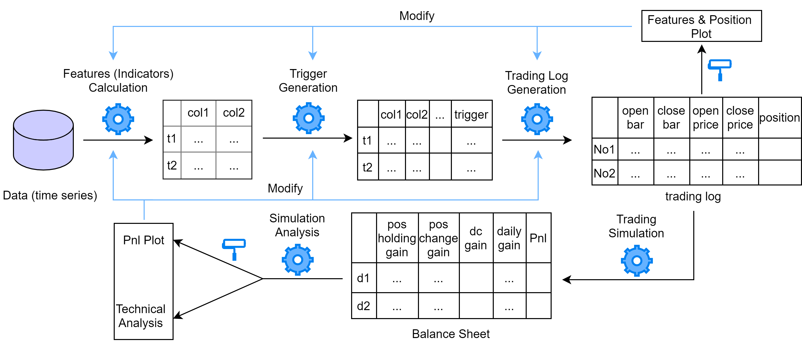

# Readme

本项目为 *CTA_trend* 源代码（已去除敏感信息：公司api接口，数据等）。策略本身设计粗糙且未被公司采用，但其中“数据获取”、“特征（指标）计算”、“策略逻辑”、“模拟交易”、“性能分析”已分模块封装，可参考该框架快速进行趋势型策略的投研开发。

### 模块介绍

```tex
- dataset (no git trace)
- output  (no git trace)
  - balance_sheet 
  - features
  - trading_logs
  - v_analysis
- __init__.py
- Dataloader.py
- F_Analysis.ipynb
- Features.py
- main.ipynb
- Setting.py
- Sim_Analysis
- Simulation.py
- Strategy.py
- utils.py
```

设计趋势型策略时，可按照以下流程进行快速实现和验证



注：出于代码书写规范的考虑，将指标计算、策略、回测等中的超参数统一在 `Setting.py` 中设置；外部库及Causis api的调用均在 `__init__.py` 中设置。

#### 1. 数据获取

`Dataloader.py` 中已封装实现 `Dataset` 类，只需在 `Setting.py` 中设置数据颗粒度（`TIME_FRAME`），回测区间起始时间（`BACKTEST_START`, `BACKTEST_END`）即可获取time series数据。数据将存储在 `dataset/` 路径下

#### 2. 特征（指标）计算

在 `Features.py` 中 `technical_analysis` 函数中定义特征，指标的计算方式。

#### 3. 策略逻辑

在 `Strategy.py` 中实现策略的入场和出场逻辑。

+ 趋势型策略的入场触发方式一般为指标到达某一动态或静态设置的水平。此外，也可定义过滤函数在信号生成时或生成后进行过滤。
+ 趋势型策略的出场方式可以是指标到达某一动态或静态设置的水平，也可以是由行情走势触发，如 *CTA_trend_v2* 中采用的动态止损。

策略逻辑这一部分需要返回做多、做空的交易单（trading log），它是时间序列数据，记录了在当前策略逻辑下，每笔交易的开仓、平仓时间节点、价格以及调仓仓位。

features & triggers 将保存在 `output/features` 路径下。

#### 4. 模拟交易

在 `Simulation.py` 实现模拟交易，计算每日净值。

本质是将 trading log 中某次调仓操作的收益平摊到持仓区间中的各天。每日收益的结算采用逐日盯市法，当日收益等于当日调仓收益、持仓收益、换月盈亏三部分之和。

trading log 和 balance sheet 将分别保存在 `output/trading_logs` 和 `output/balance_sheet` 路径下。

#### 5. 性能分析

在 `Sim_Analysis.ipynb` 中依据 balance sheet 进行策略性能分析，包括：

+ 净值曲线（BUY, SELL, ALL）
+ 性能指标：年化收益率，波动率，夏普比率，最大回撤，卡玛比率，胜率，盈亏比
+ 持仓周期统计
+ 每日调仓次数统计

### 代码运行

在 `main.ipynb` 中运行代码。可先选择单品种且打印处理信息进行调试。多品种测试时，可以接运行 `Cell2` 中的多进程代码，运行结束后在  `Sim_Analysis.ipynb` 中进行结果分析。

### 投研开发

在尝试新的趋势型策略时，可直接部分更改 *2. 特征（指标）计算*  和 *3. 策略逻辑*  中代码进行快速验证。


